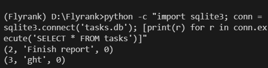

run 
uv sync

if virtual environment not activated, run 
.venv\Scripts\activate (window)
.venv/bin/activate

start the server 
fastapi dev main.py (simplest method)

python -c "import sqlite3; conn = sqlite3.connect('tasks.db'); [print(r) for r in conn.execute('SELECT * FROM tasks')]"

